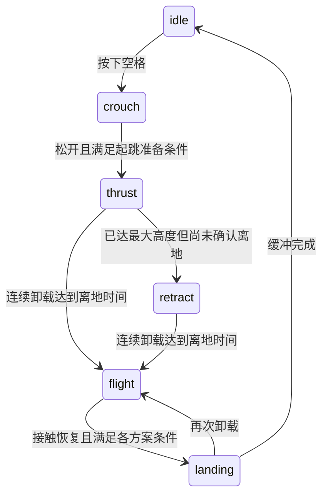

# 跳跃控制：阶段、支撑判定与空中分配

两种底盘控制器分别采用 `JumpController`（10 维 + VMC）和 `WholeBodyJumpController`（24 维底盘），实现集中在 `controllers/jump_controller.py`。`BaseJumpController` 持有唯一的 `update` 状态机（阶段推进、空中 `motion` 序列、目标与速度选择）和空中力矩分配；两版只覆写差异点：起跳就绪判据、落地触发、落地退出、收腿判定与支撑力计算。地面建模及完整控制架构见 [whole_body_lqr.md](whole_body_lqr.md)。

## 1. 入口与操作

```bash
.venv/bin/mjpython main.py --controller lqr
.venv/bin/mjpython main.py --controller whole_body_lqr
.venv/bin/mjpython main.py --controller whole_body_lqr --terrain step
```

空格按住收腿、松开起跳；1/2 继续控制前后移动，跳跃速度目标为 ±1.2 m/s；3–6 与 Shift 不抢占跳跃。旋转归位完成后才允许起跳。台阶场景能加载不代表越障已通过验收。

下文配置数值对应仓库当前 YAML，修改模型后必须重新确认可达范围和力矩余量。腿高是髋轴到轮轴沿机身竖直方向的距离

$$
h_i=e_{bz}^{\mathsf T}(p_{hip,i}-p_{wheel,i}),
$$

不是 VMC 径向长度 $L_i$；两者只在腿接近竖直时近似相同。最小/最大高度为 0.10/0.44 m，正常高度 0.24 m。

## 2. 阶段与轨迹



`phase` 表示接触/起跳阶段；`motion` 表示腿轨迹动作。空中动作依次为 extend → retract → hold → deploy，不根据预测落地时刻跳过收腿与保持。

| 动作 | 参考与结束条件 |
|---|---|
| crouch | 收到最短高度；等待释放与位置、速度、姿态准备条件 |
| extend | 蹬伸至最大高度，实际双腿均达到最大高度减 2 mm 后标记 `extended` |
| retract | 平滑收至最小高度；实际双腿进入 2 mm 误差带 |
| hold | 确认离地且实际双腿在误差带内，连续保持 50 ms |
| deploy | 展开到正常高度 |
| landing | 接触缓冲 0.6 s 后返回普通地面控制 |

两版的准备条件并非相同：10 维要求速度误差 <0.02 m/s、角速度范数 <0.03 rad/s，并持续 0.10 s；24 维使用 <0.05 m/s 和 <0.1 rad/s，无额外持续时间。两者还要求腿高误差 <2 mm、正在承载且已完成旋转归位。

10 维收腿进入 hold 还检查实际腿高速度；24 维只检查轨迹完成与实际高度误差。10 维落地条件允许下降或已经 deploy，连续卸载 20 ms 才回到 flight；24 维要求下降接触，落地中失去承载即回到 flight。这些是当前策略差异，合并文件并未把它们统一。

收腿与展开采用五次轨迹：

$$
h_r=h_s+(h_t-h_s)(10s^3-15s^4+6s^5),\qquad
s=\operatorname{clip}(t/T,0,1),
$$

$$
T=\max\left(\frac{1.875|h_t-h_s|}{v_{max}},\Delta t\right).
$$

该固定起止轨迹的端点速度和加速度为零，峰值速度受配置约束，当前 retraction_velocity=4 m/s。阶段提前切换时重新生成轨迹，并不保证任意非零速度中断点仍保持高阶连续。下蹲和蹬伸阶段参考使用斜坡。

18 个配平高度点生成姿态与前馈样条；另在九个等距高度和正常高度生成增益样条。地面与跳跃的模型缓存复用。10 维有落地专用权重，24 维沿用该方案的高度调度增益。跳跃时按当前阶段选择目标高度或实测高度作为增益/参考查询点。

## 3. 支撑力判定

控制器利用仿真真实状态和动力学量推算轮端支撑，不使用真实接触力作为控制反馈，也不引入状态估计器。对髋关节虚拟位移，固定基座、轮和云台，构造

$$
\delta q=T_a\delta a,\quad (T_a)_a=I,\quad
(T_a)_p=-J_p^+J_a.
$$

这里使用完整三维 equality 行的最小二乘消元，和地面 whole-body 线性化选八个平面独立行的直接求解有所区别。

### 3.1 10 维方案

先扣除连杆动力学：

$$
\tau_{dyn}=T_a^\mathsf T(M\dot v+h-f_p-f_e),\quad
\tau_m=T_a^\mathsf Tf_{actuator},
$$

再通过 VMC 反算虚拟力：

$$
\begin{bmatrix}\hat F_i\\\hat T_i\end{bmatrix}
=(J_i^\mathsf T)^{-1}(\tau_{m,i}-\tau_{dyn,i}),
\qquad
\hat N_i=\hat F_i\cos\theta_i-\frac{\hat T_i}{L_i}\sin\theta_i.
$$

不能直接把原始电机力矩经 VMC 反算的径向力当作地面法向力，因为它还承担了连杆惯性与重力。

### 3.2 24 维方案

定义残差

$$
r_a=T_a^\mathsf T(M\dot v+h-f_p-f_{actuator}-f_e).
$$

对左右轮端分别提取世界竖直和水平前向平移雅可比，形成四维接触力映射

$$
r_a=W\begin{bmatrix}F_{xL}&N_L&F_{xR}&N_R\end{bmatrix}^\mathsf T,
$$

直接解 $Wf=r_a$，取两项竖直分量。该推算依赖当前接触力方向假设、闭链投影与模型准确性，不是实际接触传感器读数。

两版均用滞回判定：承载时两腿正支撑力之和低于 $0.02mg$ 视为卸载；卸载后高于 $0.05mg$ 恢复承载。首次卸载即关闭轮力矩并启用空中分配，`phase` 的离地确认可滞后 20 ms。

## 4. 蹬伸与落地地面力矩

### 4.1 10 维的径向力

蹬伸每侧目标为

$$
F_i=\frac{1.5mg}{2}+k_p(\bar h-h_i)+k_d(\overline{\dot h}-\dot h_i).
$$

落地使用每侧自己的高度与速度：

$$
F_i=\frac{mg}{2}\max\left(0,1+\frac{k_{land}(h_n-h_i)-d_{land}\dot h_i}{g}\right).
$$

通过 VMC 形成径向力矩，与偏置/平衡项组合：

$$
\tau_i=\tau_{bias,i}+\tau_{balance,i}
+\alpha_iJ_i^\mathsf T[F_i,0]^\mathsf T,\qquad0\le\alpha_i\le1.
$$

先限制偏置和平衡项，再在电机余量内缩放径向项。$F_i$ 是径向力，不直接等于竖直法向力。

10 维仅在承载蹬伸阶段使用整机质心 pitch 角动量反馈调整轮力矩：

$$
\dot H=dN-zF_x,\quad
F_x^*=\frac{k_HH+d\hat N}{z},\quad
\tau_{wi}=\operatorname{clip}\left(\sigma_iR_iF_x^*/2,\pm\tau_{w,max}\right).
$$

其中 $H$ 从 `mj_angmomMat` 与真实速度求得，$d,z$ 为质心相对支撑位置的前向偏移和高度，$\sigma_i$ 是轮轴符号。其他地面阶段轮力矩来自 LQR。

### 4.2 24 维的轮端竖直力

24 维利用上一节的力映射竖直列 $W_z$，将两轮目标竖直力转换为髋力矩项：

$$
\tau_{force}=-W_z[\gamma mg/2,\gamma mg/2]^\mathsf T.
$$

蹬伸 $\gamma=1.5$；落地用平均腿高/速度形成

$$
\gamma=\max\left(0,1+\frac{k_{land}(h_n-\bar h)-d_{land}\overline{\dot h}}{g}\right).
$$

负号来自当前轮端虚位移与电机作用方向定义。再与偏置及 LQR 髋平衡项组合，在四电机限幅内统一缩放力矩项。该方案没有 10 维的左右径向同步项及蹬伸轮角动量反馈。

## 5. 空中闭链动力学

### 5.1 10 维跳跃控制使用的理想刚性模型

保留基座和八个驱动关节速度，消去被动腿关节，记 $v=Tv_r$。沿闭链相容速度中心差分 T，估计 $c=\dot Tv_r$：

$$
H_c=T(T^\mathsf TMT)^{-1}T^\mathsf T,
\quad
\dot v=H_cf_{actuator}+b,
$$

$$
b=c+H_c(f_p+f_e-h-Mc).
$$

这一空中模型由完整 MJCF 动力学量建立，说明“10 维地面 LQR”不等于整个 10 维控制器所有阶段都只用集中参数模型。

### 5.2 24 维跳跃控制使用的响应

24 维用完整 equality 雅可比构造受约束逆惯性

$$
H_c=M^{-1}-M^{-1}J_e^\mathsf T
(J_eM^{-1}J_e^\mathsf T)^+J_eM^{-1},
$$

并从当前仿真加速度提取偏置

$$
b=\dot v_{sim}-H_cf_{actuator}.
$$

伪逆用于处理三维 connect 的冗余行。这是瞬时约束响应与测得仿真偏置的组合，不是地面 24 维 A/B，也不同于 10 维空中采用的 $\dot T$ 刚性闭链偏置。软约束和瞬时接触的影响可能仍留在 b 中。

### 5.3 公共有界力矩分配

腿高雅可比包含轮/髋平移和机身竖直轴旋转：

$$
\dot h_i=J_{h_i}v,
\quad
J_{h_i}=e_{bz}^\mathsf T(J_{hip,i}-J_{wheel,i})
+[e_{bz}\times(p_{hip,i}-p_{wheel,i})]^\mathsf TJ_{\omega b}.
$$

目标姿态和腿高加速度为

$$
\alpha^*=-k_Re_R-d_R\omega,\qquad
 a_h^*=\ddot h_r+k_h(h_r-h)+d_h(\dot h_r-J_hv).
$$

令 $S_h$ 选择四髋力矩，$b_{all}$ 包含 b 和云台等其余电机作用。求

$$
\min_{|\tau_h|\le\tau_{h,max}}
\|E_RH_cS_h\tau_h+E_Rb_{all}-\alpha^*\|^2
+w_h^2\|J_hH_cS_h\tau_h+J_hb_{all}-a_h^*\|^2
+w_q^2\|\tau_h-\tau_{PD}\|^2,
$$

$$
\tau_{PD}=k_q(q_{h,ref}-q_h)-d_q\dot q_h.
$$

`lsq_linear` 使用四髋电机上下界。10 维仅把 pitch 加速度纳入姿态任务，24 维使用 roll 和 pitch；两者均跟踪两侧腿高。这里未显式补偿 $\dot J_hv$，姿态误差/广义角加速度的对应也采用局部近似。

空中两轮电机力矩为零。云台始终独立输出：24 维在离地/flight 时改用空中 PD（30、2），地面为（200、7）；10 维保持其配置中的地面云台 PD。底盘不会使用云台电机作为空中姿态控制输入，云台的反作用通过动力学响应进入分配偏置。

## 6. 验证范围

```bash
.venv/bin/mjpython -m unittest discover -s tests -v
.venv/bin/mjpython main.py --controller whole_body_lqr --terrain step --headless --duration 5
```

当前测试覆盖基础模型、控制器及场景加载；无窗口入口只验证站立运行。原 `verify_jump.py`、`verify_lqr.py`、`verify_step.py` 按目录精简要求删除，不能再用这些命令复验。

`tests/test_jump.py` 用同一段按键序列驱动两版控制器，检查阶段序列落在合法转移图上、确实离开过地面、且两版序列一致。它验证的是状态机骨架，不是腿长轨迹、50 ms 保持、空中轮零力矩或力矩限幅。

删除前，两版各自七项跳跃场景曾通过，覆盖普通跳跃、重复跳跃、旋转归位后跳跃和 pitch 扰动；当时检查了动作顺序、实际腿长、50 ms 保持、空中轮零力矩、力矩限幅和落地恢复。该历史结果不等于现有单元测试覆盖了完整跳跃状态机，也不构成实机保证。

20 cm 台阶越障仍是已知失败场景，尤其前进起跳、碰到台阶竖面以及落地切换不能从原地跳跃结果外推。24 维落地后的 `ground_height` 由 group 1 地形射线更新，用于世界高度参考；10 维没有同样的地形高度补偿。
