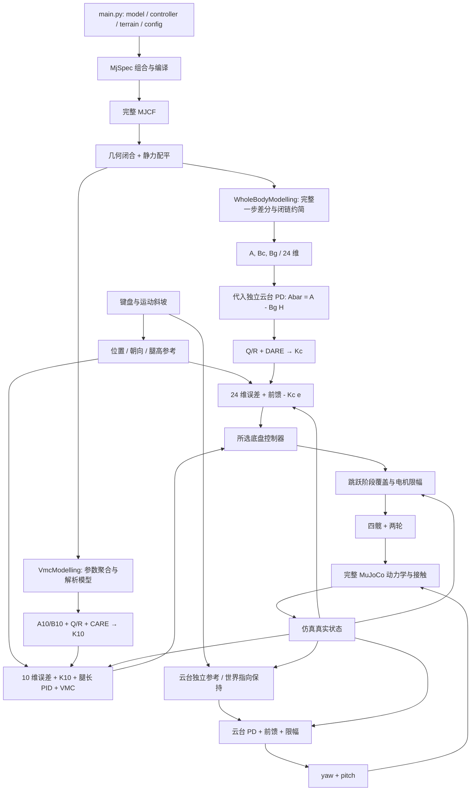

# Whole-body LQR：建模、闭链约简、独立云台与统一入口

本文对应当前 `modelling/` 与 `controllers/` 的实现。whole-body 指**用完整机器人动力学建立底盘反馈模型**：保留云台的动力学影响，但底盘只输出四个髋电机和两个轮电机的力矩。云台由独立控制器输出力矩。当前反馈增益为 **6×24**，不是历史上的 8×24 联合控制。

文中分别标明物理方程、用于解释的理想约束模型和代码实际采用的数值模型。24 维不是 MuJoCo 全状态，也不是任意运动条件下精确封闭的最小模型；它是站立接触附近的局部约简模型。跳跃阶段见 [jump.md](jump.md)。

## 1. 运行与文件职责

在项目根目录安装 `requirements.txt` 的依赖，使用 Python 3.12。macOS 的交互窗口由 `.venv/bin/mjpython` 启动：

```bash
.venv/bin/mjpython main.py
.venv/bin/mjpython main.py --controller whole_body_lqr
.venv/bin/mjpython main.py --controller whole_body_lqr --terrain step
.venv/bin/mjpython main.py --model /path/to/robot.xml --controller lqr --terrain flat
.venv/bin/mjpython main.py --model /path/to/robot.xml --controller whole_body_lqr --terrain /path/to/terrain.xml --config /path/to/control.yaml
.venv/bin/mjpython main.py --controller whole_body_lqr --headless --duration 5
```

Windows 使用 `.venv\Scripts\python.exe`，Linux 使用 `.venv/bin/python`。`--headless` 只执行零运动指令下的有限时长仿真；`--duration` 按仿真时间计，向上取整到完整步长，默认 5 s。它不是地形通过性验证或自动导航。

| 参数 | 语义 |
|---|---|
| `--model` | 机器人 MJCF，默认 `MJCF/leg_hero.xml` |
| `--controller lqr` | 10 维等效摆杆 LQR + 腿长 PID + VMC，默认方案 |
| `--controller whole_body_lqr` | 24 维建模、六路底盘 LQR、独立云台 PD |
| `--terrain flat` | 平面地形 |
| `--terrain step` | 平面及 20 cm 箱形台阶，前沿 x=3.5 m |
| `--terrain PATH` | 自定义静态地形 MJCF |
| `--config` | 覆盖所选控制器的差异 YAML；先与 `configs/base.yaml` 深合并，两种配置结构不能混用 |

`main.py` 用 `MjSpec.from_file` 分别加载机器人与地形，删除机器人中名为 `floor` 的原地面，将地形以 `terrain/` 前缀挂接到 world frame 后编译。这样地形网格、纹理和 include 可以相对于各自 XML 解析。机器人内其他几何体保留，因此应传入机器人模型，而不是另一个已包含障碍物的完整场景。参考 [MuJoCo Python 模型编辑接口](https://mujoco.readthedocs.io/en/stable/python.html#model-editing)。

自定义地形应无可动关节和驱动器；供跳跃测高的几何体使用 `group="1"`，并设置与机器人匹配的碰撞掩码。当前站立配平假定初始轮下是 z=0 的水平支撑面，不能直接在任意斜坡、悬空或高台上初始化。`--terrain` 负责加载几何，不自动扩展控制器的接触模式与可通行范围。

| 文件 | 职责 |
|---|---|
| `main.py` | 参数解析、机器人/地形组合、控制器选择、仿真入口 |
| `modelling/base.py` | 模型接口、角色映射、配平、闭链切空间与 equality 雅可比 |
| `modelling/whole_body_modelling.py` | 完整模型线性化与 24 维约简 |
| `modelling/kinematics.py` | 五杆运动学与 VMC 力/力矩映射 |
| `modelling/vmc_modelling.py` | 等效参数与 10 维连续矩阵 |
| `modelling/lqr_design.py` | Q/R、云台闭环代入、CARE/DARE 与增益 |
| `controllers/chassis.py` | 公共命令流程、参考生成与底盘生命周期 |
| `controllers/lqr_controller.py` | 10 维状态与虚拟力矩输出 |
| `controllers/whole_body_lqr_controller.py` | 24 维误差与六路底盘输出 |
| `controllers/gimbal_controller.py` | 独立云台参考与 PD |
| `controllers/jump_controller.py` | 两版跳跃策略与公共空中分配 |
| `utils/control.py` | PID 与斜坡函数 |
| `utils/viewer.py` | 跨平台窗口及键盘输入 |
| `experiment/compare_lqr.py` | 独立的两架构对照实验，输出 JSON/CSV |
| `utils/config.py` | 配置深合并与 schema 校验 |
| `configs/base.yaml` | 两版共用的 `control`、`command`、`gimbal` 与公共 `jump` 参数 |
| `tests/` | 四个测试文件：建模、配置、控制独立性、跳跃阶段机与入口组合 |

配置分两层：`configs/base.yaml` 存共用值，`configs/lqr.yaml` 与 `configs/whole_body_lqr.yaml` 只列与之不同的键。`load_config` 先按段深合并再校验，未知段、未知键、类型不符（例如把 `0.05` 写成 `"0.05"`）都会在构造控制器时直接报错，不再静默取默认值。`tests/test_config.py` 另外断言差异文件不得重述 base 中已有的相同值，避免共用参数重新变成两份。

按键：1/2 前后移动，3/4 偏航，5/6 调高，Shift 保持云台世界指向并旋转底盘，P 暂停。空格按住下蹲、松开起跳。松开 Shift 后先减速，再对齐云台世界方向。输入斜坡、目标参考、模型配平与 LQR 增益是不同层次，不应把限速器当作动力学模型。

## 2. 三个模型层次

| 层次 | 保留什么 | 用途 |
|---|---|---|
| 完整 MuJoCo 系统 | 浮动基座、全部腿部刚体、被动关节、四组 connect、轮地接触、云台 | 两种控制器共同使用的被控对象 |
| whole-body 24 维模型 | 从完整离散动力学中提取闭链相容、去侧移和轮相位的局部状态 | 直接计算六个底盘电机的反馈力矩 |
| VMC 10 维模型 | 机身、左右等效刚腿、两轮的平衡运动；腿长为设计参数 | 计算四路虚拟力矩，再由 VMC 分配到电机 |

因此“10 维忽略闭链，24 维才包含闭链”不准确。10 维的**仿真对象、配平和 VMC 几何**均有闭链；其 LQR 的 A/B 没有保留各连杆独立动态和腿长动态。24 维则把这些多体惯性、接触及执行器的局部响应带入矩阵，但通过闭链切空间消掉被动关节的独立坐标。

## 3. 完整多体动力学

### 3.1 配置、速度和力

当前机器人 `nq=23, nv=22, nu=8, na=0`。配置由自由基座的三维位置、单位四元数及 16 个标量关节组成；速度由基座六维速度及 16 个关节速度组成。关节包括四主动髋、八被动腿关节、两个轮和两个云台关节。

记

$$
q\in\mathcal Q,\quad v\in\mathbb R^{22},\quad
u=\begin{bmatrix}u_c\\u_g\end{bmatrix},\quad
u\in\mathbb R^8,
$$

其中 $u_c\in\mathbb R^6$ 为底盘力矩，$u_g\in\mathbb R^2$ 为云台力矩。四元数存在时 $v$ 不等于逐元素 $\dot q$，应写为

$$
\dot q=\mathcal N(q)v.
$$

控制中用 `mj_integratePos` 和 `mj_differentiatePos` 处理配置流形，不能直接相减四元数。MuJoCo 的广义力方程及这些坐标约定见 [官方动力学说明](https://mujoco.readthedocs.io/en/3.3.7/computation/index.html#general-framework)。下文约简是针对本仓库结构的推导。

完整动力学写为

$$
M(q)\dot v+h(q,v)
=S_cu_c+S_gu_g+f_p(q,v)+f_e
+J_e(q)^\mathsf T\lambda_e
+J_c(q)^\mathsf T\lambda_c. \tag{1}
$$

| 符号 | 对应实现 |
|---|---|
| $M$ | 全部刚体质量和惯量形成的广义质量矩阵，`qM` / `mj_fullM` |
| $h$ | 重力、科氏与离心项，`qfrc_bias` |
| $S_c,S_g$ | 电机到关节广义力的选择矩阵，本项目为 gear=1 的直接力矩电机 |
| $f_p$ | 关节阻尼等被动力，`qfrc_passive` |
| $f_e$ | 外加广义力 |
| $J_e,\lambda_e$ | 腿部 connect 约束雅可比及约束力 |
| $J_c,\lambda_c$ | 接触约束雅可比及接触力 |

这里的 $M,h$ 包括云台质量、质心偏置、转动惯量与关节运动耦合。“独立控制云台”仅指控制输出归属，不会从式 (1) 删除云台。

### 3.2 闭链与轮地约束不是一回事

每个 connect 要求两个 site 重合：

$$
\Phi_k(q)=p_{A_k}(q)-p_{B_k}(q)=0.
$$

四个 connect 在三维中给出 12 个标量方程。当前腿的所有运动位于机身 XZ 平面，横向分量冗余，选取每个 connect 在该平面的两个独立分量，共八行：

$$
J_e^{\parallel}=\operatorname{blkdiag}(P^\mathsf T,\ldots,P^\mathsf T)J_e^{3D},
\qquad P=[R_be_x,\ R_be_z],
\quad J_e^{\parallel}\in\mathbb R^{8\times22}. \tag{2}
$$

`planar_equality_jacobian` 从 `efc_J` 中仅筛选 equality，再作式 (2) 投影。轮地接触行不参加这个消元。轮地法向、摩擦与滑移的局部响应在完整仿真转移矩阵中保留，代码没有在这一阶段额外强制纯滚动。

MuJoCo 的 equality 和接触都带软约束参数。式 $\Phi=0$ 是几何/切空间构造的理想约束；实际动力学允许小的约束误差，并由求解器恢复。因此不能将约简矩阵解释为完全刚性的机械闭链在所有频率上的精确模型。

### 3.3 用理想约束解释惯性投影

此处先保留全部基座运动，将局部速度分成 14 个独立坐标速度 $v_r$ 和八个被动关节速度 $v_p$：

$$
J_rv_r+J_pv_p=0,
\qquad v_p=-J_p^{-1}J_rv_r,
\qquad v=Tv_r,
\quad T=\begin{bmatrix}I\\-J_p^{-1}J_r\end{bmatrix}. \tag{3}
$$

排列回 MuJoCo DOF 顺序后，仍有 $J_e^{\parallel}T=0$。要求 $J_p$ 非奇异；当前使用 `np.linalg.solve`，奇异装配姿态直接报错，不靠伪逆掩盖不可解的腿部构型。

由 $\dot v=T\dot v_r+\dot T v_r$，式 (1) 左乘 $T^\mathsf T$：

$$
M_r\dot v_r+h_r
=B_{rc}u_c+B_{rg}u_g
+T^\mathsf T(f_p+f_e)+J_{cr}^\mathsf T\lambda_c, \tag{4}
$$

$$
M_r=T^\mathsf TMT,\quad
h_r=T^\mathsf T(h+M\dot Tv_r),\quad
B_{r*}=T^\mathsf TS_*,\quad J_{cr}=J_cT.
$$

闭链反力被投影消去，连杆质量和惯量没有被删除：它们通过 $T^\mathsf TMT$ 进入有效惯性，通过 $h_r$ 进入重力和运动耦合。式 (4) 解释 whole-body 与集中参数刚腿的差别。

**当前 whole-body LQR 并不手工实现式 (4) 后再线性化。** 实际代码先差分完整 MuJoCo 一步映射，再用切空间提升和状态选择约简。这样会包含当前软 equality、接触模型、阻尼、时间步和积分器的共同影响；理想刚性公式只用于理解结构与部分跳跃分配。

## 4. 站立工作点：先几何闭合，再静力配平

给定腿高 $l_0$，`equilibrium` 先解几何最小二乘。未知量为 12 个腿关节位置及共同轮轴前向位置 $x_w$，条件为：

$$
\Phi_k^{XZ}=0,\qquad x_{wL}=x_{wR}=x_w,\qquad
z_{wi}=R_i,\qquad x_w=x_{\rm COM}. \tag{5}
$$

基座高度初值从腿高、平均轮径和髋安装高度推得。式 (5) 使闭链装配、轮子落地和质心投影相容，不用手工指定每个电机角度。

随后允许基座高度、roll/pitch、腿部和云台关节小幅调整，同时优化八路力矩。令 $v=\dot v=0$，执行 `mj_inverse` 并求

$$
\min_{\delta q,u^*}
\left\|\begin{bmatrix}
\tau_{\rm inverse}(q^*,0,0)-Su^*\\
100(z_b-z_{b,\rm geom})\\100\phi_b\\100\theta_b\\100q_g
\end{bmatrix}\right\|_2^2. \tag{6}
$$

10 维配平还添加左右前髋有符号位移相等的约束，用于选定对称分支；24 维沿用无该额外条件的配平分支。两者应分别从源码计算，不能假设名义关节角逐元素相同。

最终要求残差无穷范数不超过 $10^{-6}$。whole-body 进一步用正动力学检查 $\|\dot v\|_\infty\le10^{-5}$ 且至少两个接触。得到 $q^*,u^*$，后者是抵消重力并维持接触的电机前馈，不是 LQR 输出。

软接触/equality 下的动态平衡可能相对几何构型有微小沉降和闭链变形。因此要求几何残差和动力学残差各自合格，而不是误认为动态配平必须使每个 site 误差严格为零。

## 5. 为什么是 24 维

### 5.1 自由度账目

从 22 个速度自由度出发，八个独立平面闭链关系留下 14 个独立速度；再舍弃基座侧向速度，保留 13 个速度。位置坐标在相同集合中再舍弃两轮绝对转角，保留 11 个位置。合计

$$
n_x=11+13=24.
$$

等价地，完整切向状态 44 维减去被动关节位置/速度 16 维、侧向位置/速度 2 维、轮相位 2 维，得到 24 维。删除轮相位基于轮子绕轮轴的局部相位对称性；轮速不能删除，因为它影响驱动与接触。侧向速度的删除是模型假设，不是闭链自然消去的自由度。

### 5.2 状态顺序

令主动髋 $a=[a_{LF},a_{LR},a_{RF},a_{RR}]^\mathsf T$，云台角 $g=[g_y,g_p]^\mathsf T$，定义名义姿态附近的局部误差

$$
p_r=[\delta x,\delta z,\delta\phi_b,\delta\theta_b,\delta\psi_b,
\delta a^\mathsf T,\delta g^\mathsf T]^\mathsf T\in\mathbb R^{11},
$$

$$
v_r=[\delta v_x,\delta v_z,\delta\omega_x,\delta\omega_y,\delta\omega_z,
\delta\dot a^\mathsf T,\delta\dot w_L,\delta\dot w_R,
\delta\dot g^\mathsf T]^\mathsf T\in\mathbb R^{13},
\qquad x=[p_r^\mathsf T,v_r^\mathsf T]^\mathsf T. \tag{7}
$$

| 零起始列号 | 状态 |
|---|---|
| 0–4 | forward、height、roll、pitch、heading 的位置误差 |
| 5–8 | 四个髋关节位置误差 |
| 9–10 | 云台 yaw、pitch 关节位置误差 |
| 11–15 | 前向/竖直速度和基座三轴角速度误差 |
| 16–19 | 四髋速度误差 |
| 20–21 | 左右轮关节速度误差 |
| 22–23 | 云台 yaw、pitch 关节速度误差 |

`roll/pitch/heading` 是工作点附近的旋转切向坐标标签，有限角度时不等价于任意欧拉角之差。轮速列采用 MJCF 关节轴符号，不等于左右一致符号的地面线速度。输入依角色名称排列，不依 XML actuator 的原始顺序。

### 5.3 提升与选择

用 $T_v\in\mathbb R^{22\times13}$ 将保留速度提升到完整闭链相容速度。它的保留 DOF 行为单位矩阵，被动行为 $-J_p^{-1}J_r$，侧向基座行取零。

从 $T_v$ 去掉两轮列，得到 $T_q\in\mathbb R^{22\times11}$。完整流形切向状态为 $\xi=[\delta q_{\rm tan};\delta v]\in\mathbb R^{44}$：

$$
\xi=Lx,\qquad L=\operatorname{diag}(T_q,T_v)\in\mathbb R^{44\times24}.
$$

令 $E\in\mathbb R^{24\times44}$ 从完整状态取回式 (7) 的分量，则 $EL=I_{24}$。代码中 `lift` 是 $L$，`rows` 隐式表示 $E$。

$EL=I$ 不表示完整系统每一步都留在 $\operatorname{range}(L)$。被忽略的侧向扰动、软闭链变形和接触模式变化仍可能影响后续步。这是约简误差的来源；不能仅凭闭环特征值在单位圆内推断全非线性机器人全局稳定。

## 6. 从完整一步映射得到状态空间

### 6.1 连续方程的解释形式

在固定接触分支和局部坐标中，把式 (1) 的加速度写成 $a(q,v,u)$。在静止工作点线性化，完整切向连续模型可形式化写成

$$
\dot\xi=
\underbrace{\begin{bmatrix}0&I\\a_q&a_v\end{bmatrix}}_{A_f^{(c)}}\xi
+\underbrace{\begin{bmatrix}0\\a_u\end{bmatrix}}_{B_f^{(c)}}\deltau. \tag{8}
$$

其中 $a_q,a_v,a_u$ 包含约束力和接触力对状态/输入的局部导数，不能只用无约束 $M^{-1}S$ 替代。式 (8) 说明 $\dot x=Ax+Bu$ 的来源；实际控制设计采用下面的离散矩阵。

### 6.2 实际数值差分

将包含完整动力学、约束求解与积分器的一步映射记为

$$
z_{k+1}=F_{\Delta t}(z_k,u_k).
$$

代码调用 `mjd_transitionFD(model, data, epsilon, True, ...)`，当前 $\epsilon=10^{-6}$、$\Delta t=0.001\,{\rm s}$。中心差分概念上为

$$
(A_f)_{:j}\approx
\frac{F(z^*\oplus\epsilon e_j,u^*)\ominus
      F(z^*\ominus\epsilon e_j,u^*)}{2\epsilon},
$$

$$
(B_f)_{:j}\approx
\frac{F(z^*,u^*+\epsilon e_j)\ominus
      F(z^*,u^*-\epsilon e_j)}{2\epsilon}. \tag{9}
$$

$\oplus,\ominus$ 对位置使用流形积分/差分，对速度使用普通加减。函数返回的是离散一步导数；其维度约定见 [MuJoCo `mjd_transitionFD`](https://mujoco.readthedocs.io/en/stable/APIreference/APIfunctions.html#mjd-transitionfd)。它不是连续 A/B，也不能未经转换再次乘 dt 当作连续矩阵使用。

完整结果 $A_f\in\mathbb R^{44\times44},B_f\in\mathbb R^{44\times8}$。选取底盘与云台输入列，得到

$$
\boxed{A=EA_fL,\qquad B_c=EB_fU_c,\qquad B_g=EB_fU_g}, \tag{10}
$$

$$
\boxed{x_{k+1}=Ax_k+B_c\delta u_{c,k}+B_g\delta u_{g,k}}. \tag{11}
$$

维度为 $A:24\times24$、$B_c:24\times6$、$B_g:24\times2$。不能把旧八输入反馈矩阵简单删去两行：控制输入集合改变后，Riccati 方程的解也会改变。

输入按

$$
u_c=[\tau_{LF},\tau_{LR},\tau_{RF},\tau_{RR},\tau_{wL},\tau_{wR}]^\mathsf T,
\quad u_g=[\tau_{gy},\tau_{gp}]^\mathsf T
$$

排列。

## 7. 云台独立控制如何进入底盘设计

云台地面 PD 在静态参考附近为

$$
\delta u_g=-H_gx+d_g,
\qquad H_g=K_pC_{gp}+K_dC_{gv}. \tag{12}
$$

$C_{gp},C_{gv}$ 分别选择云台两维位置与两维速度；当前地面 $K_p=200I_2,K_d=7I_2$。$d_g$ 表示参考变化、前馈变化或其他云台外部命令。

代入式 (11)：

$$
\boxed{x_{k+1}=\bar Ax_k+B_c\delta u_{c,k}+B_gd_{g,k}},
\qquad \bar A=A-B_gH_g. \tag{13}
$$

求底盘 LQR 时令 $d_g=0$，使用 $(\bar A,B_c)$。底盘知道云台独立 PD 的局部动态，能够对云台运动引起的机身响应作出反馈，但**底盘 LQR 从不向云台电机写入命令**。在反馈状态中保留云台信息，与让底盘控制云台目标不是同一件事。

将状态分为底盘 $x_c\in\mathbb R^{20}$ 与云台 $x_g\in\mathbb R^4$ 后，形式上

$$
\begin{bmatrix}x_c^+\\x_g^+\end{bmatrix}
=\begin{bmatrix}A_{cc}&A_{cg}\\A_{gc}&A_{gg}\end{bmatrix}
\begin{bmatrix}x_c\\x_g\end{bmatrix}
+\begin{bmatrix}B_{cc}\\B_{gc}\end{bmatrix}\delta u_c
+\begin{bmatrix}B_{cg}\\B_{gg}\end{bmatrix}\delta u_g.
$$

机械耦合块通常不为零，因此不能为了“解耦”把云台四个状态删掉，或假定云台锁死。这里实施的是控制职责分离，不是物理耦合消失。

限制：式 (12) 是固定名义云台参考附近的近似。Shift 世界指向保持时，参考由基座姿态生成，并包含差分参考速度，其闭环整体不等于固定的 $H_g$；力矩饱和、快速云台运动和空中 PD 切换也不在同一固定线性模型内。代码会运行这些模式，但其效果需要非线性仿真检验。

## 8. 底盘 LQR 推导及实际控制律

定义无限时域代价

$$
J=\sum_{k=0}^{\infty}
\left(x_k^\mathsf TQx_k+\delta u_{c,k}^\mathsf TR\delta u_{c,k}\right),
\quad Q\succeq0,\quad R\succ0.
$$

Q 由 `whole_body_lqr.yaml` 的位置/速度权重按状态顺序构造。云台四个状态权重必须为零，代码对非零配置报错；但由于动力学耦合，最终 K 的云台列不一定为零。

$$
R=\operatorname{diag}(1/\tau_{i,\max}^2),
$$

其中髋 60 N·m、轮 4.5 N·m。云台 5 N·m 的限幅由其独立控制器使用，不在这个六维 R 中。

离散代数 Riccati 方程为

$$
P=Q+\bar A^\mathsf TP\bar A
-\bar A^\mathsf TPB_c(R+B_c^\mathsf TPB_c)^{-1}B_c^\mathsf TP\bar A,
$$

$$
\boxed{K_c=(R+B_c^\mathsf TPB_c)^{-1}B_c^\mathsf TP\bar A},
\quad \delta u_c=-K_cx. \tag{14}
$$

求解后检查 $\rho(\bar A-B_cK_c)<1$。这要求可稳定化以及代价对相关不稳定模态具有足够的可检测性；不能仅因维度正确就认为 DARE 必有稳定解。

在线输出实际为

$$
u_c=\operatorname{clip}\left(u_c^*(l)+D_c\dot q_{a,\rm ref}-K_ce,
-\tau_{\max},\tau_{\max}\right). \tag{15}
$$

这里 $e$ 是实际状态减参考状态，$u_c^*(l)$ 由静态前馈样条计算，$D_c\dot q_{a,\rm ref}$ 补偿参考关节速度对应的阻尼。参考包括世界位置、heading、腿高对应关节角、轮速及独立云台参考。

前向位置和速度误差投影到目标 heading 方向；侧向误差不进入 24 维状态。这与名义朝向下的线性化相呼应，但不能代替完整 SE(3) 轨迹线性化。地面正常行驶使用名义高度的固定 K；18 个高度配平点生成姿态/前馈样条，跳跃相关阶段另用高度增益样条。不能将正常调高描述为全过程重新在线求 DARE。

参考模型没有动态逆动力学的完整 $M\ddot q_{ref}+h$ 前馈。因此快速轨迹仍会产生参考残差。非零参考时，更完整的误差式包含

$$
e_{k+1}\approx(\bar A-B_cK_c)e_k+B_gd_{g,k}+r_{{ref},k},
$$

$r_{ref}$ 汇集参考运动、线性化工作点不匹配及未建模项。饱和后实际闭环也不再是固定的 $\bar A-B_cK_c$。

## 9. 10 维 VMC modelling 的详细含义

### 9.1 等效参数来自 MJCF

将 base、yaw、pitch 刚体聚合为机身；每侧所有腿部刚体聚合为一根等效腿，轮体单列。对任意刚体集合：

$$
m=\sum_i m_i,\quad c=\frac{\sum_i m_ic_i}{m},
$$

$$
I_c=\sum_i\left[R_iI_iR_i^\mathsf T
+m_i\left(\|c_i-c\|^2I-(c_i-c)(c_i-c)^\mathsf T\right)\right]. \tag{16}
$$

`aggregate_inertia` 使用世界惯性坐标和并轴定理，不直接相加局部惯量矩阵。质量、轮径、半轮距、腿长、腿质心到轮/髋距离均由配平姿态提取。云台质量计入机身参数，但云台相对机身的运动没有进入 10 维 A/B。

左右腿质量及轮惯量采用平均值；左右腿长、质心分段长度与腿 pitch 惯量分别保留。偏航惯量取整机聚合的世界 z 轴分量。这是一组工作点附近的等效参数，不是完整多体质量矩阵。

### 9.2 状态、虚拟输入与中间动力学

$$
x_{10}=[s,\dot s,\psi,\dot\psi,\theta_L,\dot\theta_L,
\theta_R,\dot\theta_R,\theta_b,\dot\theta_b]^\mathsf T,
$$

$$
u_v=[T_{wL},T_{wR},T_{bL},T_{bR}]^\mathsf T.
$$

这里 $s$ 在控制器中来自两轮世界轴向角速度换算后的里程积分，$\theta_{L/R}$ 是等效腿在世界竖直方向附近的摆角，$\theta_b$ 是机身 pitch。腿长、竖直运动、roll、云台转角均不在这个状态中。

为精确对应 `equivalent_dynamics`，定义中间加速度变量

$$
\ddot\eta=[\ddot\varphi_L,\ddot\varphi_R,
\ddot\theta_L,\ddot\theta_R,\ddot\theta_b]^\mathsf T.
$$

以 $r$ 表示轮径、$b$ 表示半轮距、$l_L,l_R$ 表示腿长，$l_{wi},l_{bi}$ 为腿质心到轮和髋的分段距离；$l_c=z_{hip}-z_{COM,b}$ 是带符号距离。代码的直立线性方程为

$$
\mathcal M\ddot\eta=G\theta+Du_v,\qquad
\theta=[\theta_L,\theta_R,\theta_b]^\mathsf T. \tag{17}
$$

令

$$
c_7=-[(m_w+m_l+m_b/2)r^2+I_w],\quad
c_{11}=(m_w+m_l)rl_c+I_wl_c/r,\quad
c_{16}=I_zr/(2b)+I_wb/r,
$$

则源码中的系数矩阵为

$$
\mathcal M=\begin{bmatrix}
I_wl_L/r+m_wrl_L+m_lrl_{bL}&0&m_ll_{wL}l_{bL}-I_{lL}&0&0\\
0&I_wl_R/r+m_wrl_R+m_lrl_{bR}&0&m_ll_{wR}l_{bR}-I_{lR}&0\\
c_7&c_7&-(m_lrl_{wL}+m_brl_L/2)&-(m_lrl_{wR}+m_brl_R/2)&0\\
c_{11}&c_{11}&m_ll_{wL}l_c&m_ll_{wR}l_c&-I_b\\
c_{16}&-c_{16}&I_zl_L/(2b)&-I_zl_R/(2b)&0
\end{bmatrix},
$$

$$
G=\begin{bmatrix}
-(m_ll_{wL}+m_bl_L/2)g&0&0\\
0&-(m_ll_{wR}+m_bl_R/2)g&0\\
0&0&0\\0&0&-m_bgl_c\\0&0&0
\end{bmatrix},\quad
D=\begin{bmatrix}
1+l_L/r&0&-1&0\\
0&1+l_R/r&0&-1\\
-1&-1&0&0\\
l_c/r&l_c/r&1&1\\
b/r&-b/r&0&0
\end{bmatrix}. \tag{18}
$$

$\mathcal M$ 是消去中间力后的加速度方程系数，**不是**以同一组广义坐标写出的对称正定拉格朗日质量矩阵。其非对称性或部分负号不能直接解释为负惯量；符号必须与式 (17) 的变量/方程一起使用。

到受控坐标加速度的变换为

$$
\begin{bmatrix}\ddot s\\\ddot\psi\\\ddot\theta_L\\\ddot\theta_R\\\ddot\theta_b\end{bmatrix}
=C\ddot\eta,\quad
C=\begin{bmatrix}
r/2&r/2&0&0&0\\
-r/(2b)&r/(2b)&-l_L/(2b)&l_R/(2b)&0\\
0&0&1&0&0\\0&0&0&1&0\\0&0&0&0&1
\end{bmatrix}. \tag{19}
$$

一次求解

$$
[F_\theta\ F_u]=C\mathcal M^{-1}[G\ D]
$$

即可组装连续系统

$$
\boxed{\dot x_{10}=A_{10}x_{10}+B_{10}u_v},
$$

$$
(A_{10})_{2i,2i+1}=1,\quad
(A_{10})_{\{1,3,5,7,9\},\{4,6,8\}}=F_\theta,\quad
(B_{10})_{\{1,3,5,7,9\},:}=F_u. \tag{20}
$$

下标从零开始，其余位置为零。实现使用 `np.linalg.solve` 而非显式逆矩阵。VMC 模型 `timestep=0` 表示连续时间模型，控制层解 CARE；whole-body 的 `timestep=0.001` 表示离散模型，控制层解 DARE。

10 维控制代价按配置中的状态/虚拟力矩尺度归一化。连续 Riccati 方程与增益为

$$
A^\mathsf TP+PA-PBR^{-1}B^\mathsf TP+Q=0,\qquad K_{10}=R^{-1}B^\mathsf TP.
$$

代码报告的该方案“spectral radius”是 $\exp(\Delta t\max\Re\lambda(A-BK))$，不是含腿长 PID、VMC、采样与饱和的完整离散闭环实测谱半径。

### 9.3 VMC 处理闭链几何和功率映射

每侧腿将两个主动关节 $a_i$ 映射为虚拟坐标 $y_i=[L_i,\phi_i]^\mathsf T$：

$$
\dot y_i=J_i\dot a_i,\qquad
\tau_i^\mathsf T\dot a_i=f_i^\mathsf T\dot y_i,
\quad
\boxed{\tau_i=J_i^\mathsf T\begin{bmatrix}F_i\\T_i\end{bmatrix}}. \tag{21}
$$

`Leg` 从 MJCF 提取杆长、轴向符号和几何偏置；`VMC` 求平面五杆闭合与解析雅可比。当前采用共轴、上下左右配对等长的几何形式，不能任意更改五杆拓扑后仍沿用这个解析映射。

10 维 LQR 输出左右轮力矩与左右虚拟摆杆力矩；每侧腿长 PID 另外给出径向力：

$$
F_i=F_i^*(l)+K_P(L_{ref,i}-L_i)
+K_I\int(L_{ref,i}-L_i)dt+K_D\frac{d}{dt}(L_{ref,i}-L_i).
$$

再把 $(F_i,T_i^*+T_{bi})$ 经式 (21) 映射并限幅。VMC 是瞬时虚功映射，不是把所有连杆的惯性、闭链反力与摩擦自动补偿掉的动态逆模型。

## 10. 两种 modelling 的本质区别与效果边界

| 项目 | VMC / 10 维 | whole-body / 24 维 |
|---|---|---|
| 仿真对象 | 完整同一 MJCF | 完整同一 MJCF |
| LQR 模型来源 | 集中参数等效动力学解析线性式 | 完整 MuJoCo 一步映射差分后约简 |
| 闭链 | 配平与 VMC 几何显式处理；连杆惯性聚合 | 差分中含完整 equality 响应，切空间消去被动独立坐标 |
| 腿长/竖直/roll | 不在 10 维 LQR 中；腿长另用 PID | 保留高度、roll 与各髋状态 |
| 云台 | 静态聚合质量/惯量，动态耦合未显式进入 A/B | 保留四个云台状态和 $B_g$，代入独立 PD |
| 输入 | 四个虚拟力矩，经 VMC + 径向力变为六电机力矩 | 六个实际底盘电机力矩 |
| 增益求解 | CARE，4×10 | DARE，6×24 |
| 接触/积分器 | 简化滚动平衡假设 | 名义接触及当前积分器的局部响应进入 A/B |
| 主要局限 | 刚腿等效、腿长回路耦合不在 LQR 内 | 接触切换、快速参考、侧滑和软约束约简误差 |

纯反馈矩阵乘法分别约 40 和 144 次乘法；这只是反馈乘法成本。whole-body 初始化要做配平和完整有限差分，通常比单次解析矩阵组装复杂，但两版都需要参考样条与多高度设计。在线 10 维还要更新 VMC、虚拟状态和 PID，24 维直接取状态并乘 K，因此实际控制循环不一定是 24 维更慢。跳跃的逆动力学及有界最小二乘应单独计时。

更贴近**当前仿真模型**的局部动态，可使 24 维更好地协调高度、roll、pitch 与云台反作用；但不自动保证更好的实机表现。实机效果还取决于惯量、减速器/电机带宽、摩擦、间隙、结构柔性、接触参数和时延是否可信。本实现无电流环/力矩执行动态状态，两种 LQR 均没有把实测接触力作为带参考的力闭环反馈量。因此不能把站立支撑力波动更小直接称作“力控带宽更高”。

选择依据应是相同任务、相同输入限制下的跟踪、扰动恢复、力矩饱和与实际计算开销，而非状态数本身。

## 11. 完整控制框图



两条底盘分支是运行时二选一。物理循环是先计算控制、再 `mj_step`；不包含状态估计或学习策略。模型类只负责物理参数、工作点和矩阵，不导入控制器，也不存储 Q/R、PID 或 Riccati 解。

## 12. 替换模型与方法的接口

```python
from pathlib import Path
import mujoco
from modelling.whole_body_modelling import WholeBodyModelling
from modelling.vmc_modelling import VmcModelling
from controllers.whole_body_lqr_controller import WholeBodyLqrController

model = mujoco.MjModel.from_xml_path("MJCF/leg_hero.xml")
whole = WholeBodyModelling(model).linearize(0.24)
vmc = VmcModelling(model).linearize(0.24)
controller = WholeBodyLqrController(model=model)
# 也可传 Path，由控制器直接读取一个已经带地面的模型。
controller = WholeBodyLqrController(model=Path("MJCF/leg_hero.xml"))
```

公共 `StateSpaceModel` 返回 `a, b, timestep, state_names, input_names, point`；工作点含 `qpos, torque, residual`。whole-body 还返回 `b_gimbal, lift, rows` 及索引，VMC 还返回等效物理参数。模型实例按高度缓存配平与矩阵；修改 MjModel 的物理参数后应重建 modelling 实例，不能沿用旧缓存。

两个控制器支持 `modelling_type` 注入遵守本方案状态/输入语义的建模子类。这个扩展点不意味着 10 维与 24 维可直接交叉替换：状态提取、输入分配、时间域以及模型附加字段都必须匹配。未来 MPC 可复用模型矩阵，但要自行处理接触模式、云台参考及力矩限制。

同构模型契约：自由基座在前，世界 Z 向上，腿部保持 XZ 平面机构与角色命名，四个 connect、八个被动腿关节、六个底盘电机和两个云台电机；电机为 gear=1 的直接关节力矩，无内部 activation。可重排 actuator，映射依名称提取。不能任意改变根关节结构、齿轮比、命名、闭链拓扑或使腿部雅可比奇异。VMC 还有共轴平面五杆及平均参数假设；模型“结构相同”也不保证任意质量配置均能稳定。

## 13. 验证、历史结果与未解决问题

```bash
.venv/bin/mjpython -m unittest discover -s tests -v
.venv/bin/mjpython main.py --controller lqr --terrain flat --headless --duration 5
.venv/bin/mjpython main.py --controller whole_body_lqr --terrain step --headless --duration 5
.venv/bin/mjpython -m experiment.compare_lqr --output reports/lqr_comparison
.venv/bin/python -m black --check .
```

必要测试检查：切空间闭链相容性、PD 闭合模型的一步预测、修改云台质量并重排 actuator 的同构模型、VMC 虚功、配平接触力与稳定性、俯仰扰动恢复、云台输出不受底盘 K 修改影响，以及两种控制器与地形的组合加载。入口测试只证明初始站立成功，不证明通过台阶。

`experiment/compare_lqr.py` 对两版采用同一初始姿态/速度和命令序列，包含站立、扰动、直行/倒车、偏航、升降、云台偏置和 Shift 旋转，共 16 组场景、32 次试验。控制函数耗时排除观测、CSV 写入和 `mj_step`，初始化包含配平及高度样条。世界位置误差与轮式里程误差分别记录，支撑力从实际接触测量。状态 `completed` 只表示完成且未触发数值/姿态/闭链等阈值，不表示每项跟踪性能均达到需求。

2026-10-01 完成入口整理后，七项测试通过、两个 CLI 无窗口运行成功；32 次对照全部完成，非计时指标与整理前完全一致。对照脚本直接读取默认机器人模型；统一入口组合地形另由测试覆盖。完整指标和实验使用的模型/控制代码哈希见 [lqr_comparison.json](data/lqr_comparison.json)。本次在 macOS ARM64、Python 3.12.13、MuJoCo 3.14.0 验证，结果如下：

| 指标 | 10 维 + VMC | 24 维底盘 |
|---|---:|---:|
| 直行最终世界位置误差 | 32.94 mm | 6.52 mm |
| 反向最终世界位置误差 | 10.82 mm | 50.80 mm |
| 周期升降支撑偏差 RMS / mg | 0.01435 | 0.00699 |
| 云台初始偏差时机身 pitch 峰值 | 0.06143° | 0.02246° |
| Shift 云台世界指向误差峰值 | 0.07993° | 0.07766° |

这些数据表明指标存在取舍，而不是 24 维普遍优于 10 维。当前保留的测试和对比脚本取代日常分散入口；`verify_*.py`、源码快照、快照生成器和旧技术文档已删除。旧的 22 项地面和每版 7 项跳跃回归曾通过，但删除脚本后不再把它们列为当前可执行检查。

20 cm 台阶越障是既有未解决问题。地形加载成功、原地跳跃成功和站立稳定不构成越障验收。当前未进行实机验证，窗口和跨平台效果也需在各目标平台单独检查。

## 14. 维护约定

原根目录 `AGENTS.md` 的开发约定归并于此：只使用传统运动控制，不引入强化学习或状态估计；代码优先从 MJCF 和配置推导参数。Python 使用 Black，保留严格类型提示，避免无用转换、重复入口与静默兜底。物理模型或控制架构改变时，应同时检查工作点、闭链约束、输入归属、线性预测和实际运动表现。

非必要不写注释，以清晰命名和准确类型提示表达意图；逻辑块之间留空行。不使用 assert 或静默兜底；删除无用导入、变量和调用。复杂物理与数学推导使用 LaTeX，优先检查 equality 稳定性。执行示例默认使用 `.venv/bin/mjpython`。
